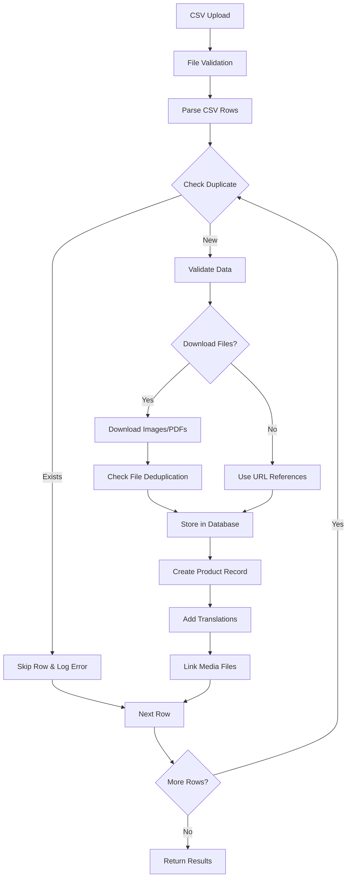

# CSV Bulk Import Documentation

## Overview
The KITMED platform provides a bulk CSV import feature for efficiently adding multiple products to the catalog. This document explains the complete process, limitations, and best practices.

## Import Process Flow

### 1. File Upload
- **Endpoint**: `/api/admin/products/bulk-import`
- **Method**: POST with multipart/form-data
- **File Limits**:
  - Maximum size: 10MB
  - Maximum rows: 500 products per import
  - Format: CSV with comma delimiter

### 2. CSV Structure

#### Required Fields
| Field | Description | Example |
|-------|-------------|---------|
| `referenceFournisseur` | Unique supplier reference (acts as SKU) | MED-001 |
| `constructeur` | Manufacturer name | Philips |
| `categoryId` | Category UUID from database | cardiology-uuid |
| `nom_fr` | Product name in French | Moniteur ECG |
| `nom_en` | Product name in English | ECG Monitor |

#### Optional Fields
| Field | Description | Example |
|-------|-------------|---------|
| `description_fr` | French description | Description détaillée |
| `description_en` | English description | Detailed description |
| `ficheTechnique_fr` | French technical specs | Spécifications techniques |
| `ficheTechnique_en` | English technical specs | Technical specifications |
| `pdfBrochureUrl` | URL to PDF brochure | https://example.com/brochure.pdf |
| `imageUrl` | Primary product image | https://example.com/product.jpg |
| `imageUrl2` | Secondary image | https://example.com/product2.jpg |
| `imageUrl3` | Third image | https://example.com/product3.jpg |
| `status` | Product status | active, inactive, discontinued |
| `featured` | Featured product flag | true/false |
| `sortOrder` | Display order | 1, 2, 3... |

### 3. Processing Steps



### 4. Deduplication Logic

#### Product Deduplication
- **Primary Key**: `referenceFournisseur` must be unique
- **Behavior**: Duplicates are rejected with error message
- **No Updates**: Cannot update existing products via CSV import
- **Error Example**: "Product with reference MED-001 already exists"

#### File Deduplication
- **URL Hash**: SHA-256 hash of normalized URL prevents re-downloading
- **Content Hash**: SHA-256 of file content detects identical files from different URLs
- **Storage Savings**: Same file used for multiple products
- **Location**: Files stored in `/public/uploads/products/` and `/public/uploads/brochures/`

### 5. Example CSV Files

#### Basic Import
```csv
referenceFournisseur,constructeur,categoryId,nom_fr,nom_en,status
MED-001,Philips,123e4567-e89b,Moniteur Patient,Patient Monitor,active
MED-002,Siemens,123e4567-e89b,Scanner IRM,MRI Scanner,active
```

#### Full Import with Media
```csv
referenceFournisseur,constructeur,categoryId,nom_fr,nom_en,description_fr,description_en,pdfBrochureUrl,imageUrl,featured,status
MED-001,Philips,123e4567-e89b,Moniteur ECG,ECG Monitor,Description complète,Full description,https://example.com/brochure.pdf,https://example.com/monitor.jpg,true,active
```

## Limitations & Constraints

### No Multi-SKU Support
- **One Product = One SKU**: Each CSV row creates a single product
- **No Variants**: Cannot create product variants (size, color, model)
- **No Parent-Child**: No product hierarchy support

### Workarounds for Multiple SKUs
If you have products with variants, you must create separate products:

```csv
# Instead of one product with variants, create multiple products
MED-001-S,Philips,category,ECG Monitor - Small,Moniteur ECG - Petit
MED-001-M,Philips,category,ECG Monitor - Medium,Moniteur ECG - Moyen
MED-001-L,Philips,category,ECG Monitor - Large,Moniteur ECG - Grand
```

### Other Limitations
- **No Bulk Updates**: Cannot update existing products
- **No Price Management**: Products don't have price fields
- **No Inventory**: No stock level tracking
- **Sequential Processing**: Not optimized for very large datasets
- **No Rollback**: Partial imports remain if process fails

## Error Handling

### Common Errors
1. **Duplicate Reference**: Product already exists with same `referenceFournisseur`
2. **Invalid Category**: Category ID not found in database
3. **Missing Required Fields**: Required fields are empty
4. **File Download Failed**: Unable to download image/PDF from URL
5. **Invalid File Type**: Non-CSV file uploaded

### Error Response Format
```json
{
  "success": false,
  "data": {
    "imported": 45,
    "failed": 5,
    "errors": [
      {
        "row": 23,
        "field": "referenceFournisseur",
        "message": "Product with reference MED-001 already exists"
      }
    ]
  }
}
```

## Performance Considerations

- **Batch Size**: Keep under 500 products per import
- **File Downloads**: Enable only if needed (slows import significantly)
- **Image Optimization**: Images are automatically optimized with Sharp
- **Database Transactions**: Each product in separate transaction for reliability
- **Processing Time**: ~100ms per product without file downloads, ~2-5s with downloads

## Best Practices

1. **Validate Category IDs**: Ensure all category IDs exist before import
2. **Unique References**: Verify `referenceFournisseur` uniqueness before import
3. **Test Small Batches**: Start with 10-20 products to test
4. **Use Consistent Naming**: Maintain naming conventions across languages
5. **Optimize Images**: Pre-optimize images before providing URLs
6. **Error Recovery**: Keep track of failed rows for re-import
7. **Regular Cleanup**: Use file cleanup API to remove orphaned files

## API Usage Example

```javascript
// Frontend upload component
const handleCSVUpload = async (file) => {
  const formData = new FormData();
  formData.append('file', file);
  formData.append('downloadFiles', 'true'); // Optional: download media files
  
  const response = await fetch('/api/admin/products/bulk-import', {
    method: 'POST',
    headers: {
      'Authorization': `Bearer ${token}`
    },
    body: formData
  });
  
  const result = await response.json();
  if (result.success) {
    console.log(`Imported ${result.data.imported} products`);
  } else {
    console.error('Import errors:', result.data.errors);
  }
};
```

## Database Schema

### Products Table
```sql
products {
  id                    UUID (auto-generated)
  reference_fournisseur STRING (unique, required)
  constructeur         STRING (required)
  category_id          UUID (foreign key)
  slug                 STRING (auto-generated)
  status               ENUM (active/inactive/discontinued)
  is_featured          BOOLEAN
  pdf_brochure_url     STRING
  sort_order           INTEGER
  created_at           TIMESTAMP
  updated_at           TIMESTAMP
}
```

### Product Translations
```sql
product_translations {
  id                STRING
  product_id        UUID (foreign key)
  language_code     STRING (fr/en)
  nom              STRING
  description      TEXT
  fiche_technique  TEXT
  meta_title       STRING
  meta_description STRING
}
```

## Maintenance

### File Cleanup
Remove orphaned files periodically:
```bash
# Mark orphaned files
curl -X POST /api/admin/files/cleanup?action=mark_orphaned

# Delete orphaned files older than 7 days
curl -X POST /api/admin/files/cleanup?action=cleanup&days=7
```

### Import Statistics
Track import efficiency:
```bash
# Get deduplication stats
curl /api/admin/files/cleanup?action=stats
```

## Troubleshooting

### Import Fails Immediately
- Check CSV file size (< 10MB)
- Verify CSV format (comma-delimited, UTF-8)
- Ensure authentication token is valid

### Products Not Appearing
- Check `status` field is set to 'active'
- Verify category IDs are valid
- Ensure required translations are provided

### Files Not Downloading
- Verify URLs are accessible
- Check file size limits
- Ensure proper MIME types

### Slow Import Performance
- Reduce batch size
- Disable file downloads if not needed
- Pre-optimize images
- Check database connection pool

## Support

For issues or questions about the CSV import feature:
- Check error logs in `/api/admin/products/bulk-import` responses
- Review file registry for download issues
- Monitor server logs for detailed error messages