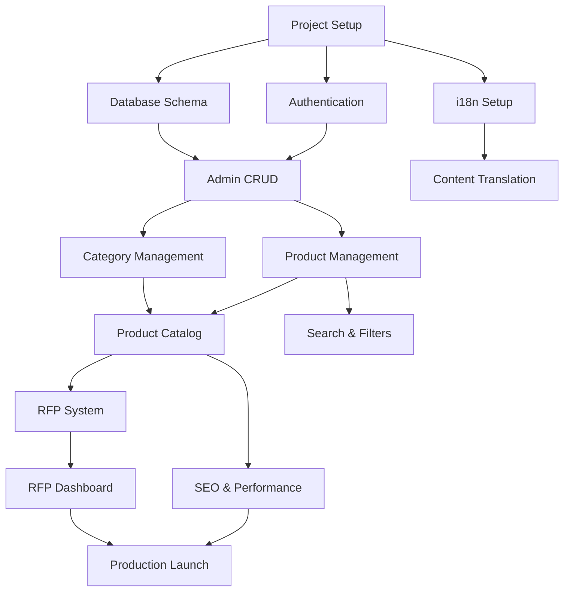

# KITMED Implementation Priority Matrix

## Priority Framework

**Priority Levels**:
- **P0 (Critical)**: Core functionality, blocking other features
- **P1 (High)**: Important for MVP launch
- **P2 (Medium)**: Post-MVP enhancements
- **P3 (Low)**: Future optimizations

**Effort Scale**: 
- **XS** (1-2 days): Simple components/features
- **S** (3-5 days): Standard features
- **M** (1-2 weeks): Complex features
- **L** (2-4 weeks): Major systems
- **XL** (1+ months): Large initiatives

## Phase 1: Foundation (Weeks 1-3)

| Feature | Priority | Effort | Dependencies | Business Value | Technical Risk |
|---------|----------|--------|--------------|----------------|----------------|
| **Project Setup & Infrastructure** |
| Next.js 14 project scaffold | P0 | XS | None | High | Low |
| TypeScript configuration | P0 | XS | Next.js setup | High | Low |
| shadcn/ui installation | P0 | S | Next.js, TS | High | Low |
| Tailwind CSS setup | P0 | XS | shadcn/ui | High | Low |
| Database schema implementation | P0 | M | PostgreSQL | High | Medium |
| Prisma ORM setup | P0 | S | Database schema | High | Low |
| **Authentication System** |
| JWT authentication library | P0 | S | None | High | Low |
| Login/logout functionality | P0 | S | JWT setup | High | Low |
| Protected admin routes | P0 | S | Authentication | High | Medium |
| Role-based access control | P1 | M | Authentication | Medium | Medium |
| **Basic UI Components** |
| Layout components (Header, Footer) | P0 | S | shadcn/ui | High | Low |
| Navigation components | P0 | M | Layout | High | Medium |
| Form components (inputs, buttons) | P0 | S | shadcn/ui | High | Low |
| Loading states | P1 | S | Components | Medium | Low |

**Phase 1 Success Criteria**:
- ✅ Development environment fully configured
- ✅ Basic authentication working
- ✅ Database connected and seeded
- ✅ UI component library functional

## Phase 2: Product Catalog (Weeks 4-6)

| Feature | Priority | Effort | Dependencies | Business Value | Technical Risk |
|---------|----------|--------|--------------|----------------|----------------|
| **Category Management** |
| Category CRUD (admin) | P0 | M | Auth, DB schema | High | Low |
| Category hierarchy display | P0 | M | Category CRUD | High | Medium |
| Category navigation menu | P0 | M | Categories | High | Medium |
| Category translations (i18n) | P1 | L | Categories | High | High |
| **Product Management** |
| Product CRUD (admin) | P0 | L | Categories, Auth | High | Medium |
| Product list/grid view | P0 | M | Products CRUD | High | Low |
| Product detail pages | P0 | M | Products | High | Medium |
| Product search functionality | P1 | L | Products | High | High |
| Product filtering | P1 | M | Search | Medium | Medium |
| **Media Management** |
| Image upload system | P0 | M | File storage | High | Medium |
| Product image gallery | P1 | M | Image upload | Medium | Low |
| File management (admin) | P1 | M | Upload system | Medium | Medium |
| **Data Import** |
| CSV product import | P1 | L | Products CRUD | High | High |
| Import validation | P1 | M | CSV import | Medium | Medium |
| Bulk operations | P2 | M | Products | Low | Medium |

**Phase 2 Success Criteria**:
- ✅ Complete product catalog browsing
- ✅ Admin can manage products and categories
- ✅ Public users can search and filter products
- ✅ Image handling fully functional

## Phase 3: RFP System (Weeks 7-8)

| Feature | Priority | Effort | Dependencies | Business Value | Technical Risk |
|---------|----------|--------|--------------|----------------|----------------|
| **RFP Front-end** |
| RFP cart functionality | P0 | M | Products | High | Medium |
| Multi-product selection | P0 | M | RFP cart | High | Low |
| RFP submission form | P0 | M | Cart | High | Medium |
| Form validation | P0 | S | RFP form | High | Low |
| **RFP Backend** |
| RFP data model | P0 | S | DB schema | High | Low |
| RFP API endpoints | P0 | M | Data model | High | Medium |
| Email notifications | P1 | M | RFP API | High | Medium |
| **Admin RFP Management** |
| RFP dashboard | P0 | L | RFP backend | High | Medium |
| RFP status tracking | P0 | M | Dashboard | High | Low |
| Quote generation | P1 | L | RFP system | Medium | High |
| Export functionality | P2 | M | Dashboard | Low | Medium |
| **Customer Features** |
| RFP status tracking | P1 | M | RFP system | Medium | Medium |
| Customer notifications | P1 | M | Email system | Medium | Medium |

**Phase 3 Success Criteria**:
- ✅ Customers can create and submit RFPs
- ✅ Admin can manage and respond to RFPs
- ✅ Email notifications working
- ✅ Basic quote generation available

## Phase 4: Content & Optimization (Weeks 9-10)

| Feature | Priority | Effort | Dependencies | Business Value | Technical Risk |
|---------|----------|--------|--------------|----------------|----------------|
| **Content Management** |
| Partner management | P1 | M | Auth, CRUD | Medium | Low |
| Partner showcase page | P1 | S | Partners | Medium | Low |
| Banner system | P1 | M | Content CMS | Medium | Medium |
| Dynamic page builder | P2 | L | CMS | Low | High |
| **SEO & Performance** |
| SSR/SSG implementation | P0 | L | Next.js | High | High |
| Meta tags optimization | P0 | M | SSR | High | Medium |
| Sitemap generation | P1 | S | SEO | Medium | Low |
| Schema.org markup | P1 | M | SEO | Medium | Medium |
| Image optimization | P1 | M | Media system | Medium | Low |
| **Internationalization** |
| Multi-language setup | P0 | L | next-intl | High | High |
| Content translations | P1 | L | i18n setup | High | Medium |
| Language switcher | P1 | S | i18n | Medium | Low |
| URL localization | P2 | M | i18n | Low | High |
| **Contact & Info Pages** |
| Contact form | P1 | M | Email system | Medium | Low |
| Company info pages | P1 | S | CMS | Medium | Low |
| About page | P2 | S | Content | Low | Low |

**Phase 4 Success Criteria**:
- ✅ SEO optimized with proper meta tags
- ✅ Multi-language support functional
- ✅ Partner showcase complete
- ✅ Performance benchmarks met

## Phase 5: Polish & Launch (Weeks 11-12)

| Feature | Priority | Effort | Dependencies | Business Value | Technical Risk |
|---------|----------|--------|--------------|----------------|----------------|
| **Testing & Quality** |
| Unit test coverage | P1 | L | All features | Medium | Low |
| E2E testing | P1 | M | Complete app | Medium | Medium |
| Performance optimization | P0 | M | All features | High | Medium |
| Security audit | P0 | M | Complete app | High | Medium |
| **User Experience** |
| Mobile responsiveness | P0 | M | All components | High | Medium |
| Loading states | P1 | M | All features | Medium | Low |
| Error boundaries | P1 | M | App structure | Medium | Medium |
| Accessibility (a11y) | P2 | L | All components | Low | Medium |
| **Analytics & Monitoring** |
| Error tracking | P1 | S | None | Medium | Low |
| Performance monitoring | P1 | S | None | Medium | Low |
| Analytics setup | P2 | S | None | Low | Low |
| **Deployment** |
| Production environment | P0 | M | Infrastructure | High | High |
| CI/CD pipeline | P1 | M | Git repo | Medium | Medium |
| Backup strategy | P1 | S | Database | Medium | Low |
| SSL/Domain setup | P0 | S | Hosting | High | Medium |

**Phase 5 Success Criteria**:
- ✅ All core functionality tested
- ✅ Performance meets targets
- ✅ Production deployment successful
- ✅ Monitoring and analytics active

## Feature Dependency Graph

## Risk Assessment by Phase

### Phase 1 Risks (Low Overall Risk)
- **Database Design**: Medium complexity, well-documented patterns
- **Authentication**: Standard implementation, many examples
- **UI Setup**: Low risk, established tooling

### Phase 2 Risks (Medium Overall Risk)
- **Search Implementation**: High complexity, performance concerns
- **CSV Import**: Data validation challenges
- **i18n**: Complex routing and content management

### Phase 3 Risks (Medium Overall Risk)
- **Email System**: External dependencies
- **RFP Workflow**: Complex business logic
- **Quote Generation**: Custom business requirements

### Phase 4 Risks (High Overall Risk)
- **SEO Implementation**: Technical complexity with SSR/SSG
- **Performance Targets**: May require significant optimization
- **Multi-language**: URL routing complexity

### Phase 5 Risks (Medium Overall Risk)
- **Production Deploy**: Infrastructure complexity
- **Performance Tuning**: May reveal unexpected bottlenecks
- **Security Review**: May uncover critical issues

## Quick Wins (High Value, Low Effort)

| Feature | Phase | Business Impact | Implementation Time |
|---------|-------|-----------------|-------------------|
| Basic product listing | 2 | High | 3 days |
| Simple search | 2 | High | 2 days |
| Contact form | 4 | Medium | 1 day |
| Partner logos | 4 | Medium | 1 day |
| Basic RFP form | 3 | High | 3 days |
| Admin login | 1 | High | 2 days |
| Error pages | 5 | Medium | 1 day |

## Implementation Recommendations

### Week 1-3: Establish Foundation
**Focus**: Get core infrastructure solid before building features
**Key Deliverables**: 
- Development environment
- Basic auth working
- Database connected
- UI components functional

### Week 4-6: Core Business Logic
**Focus**: Product catalog as the heart of the application
**Key Deliverables**:
- Complete product management
- Public product browsing
- Admin category management
- Basic search functionality

### Week 7-8: Revenue Driver
**Focus**: RFP system as primary business value
**Key Deliverables**:
- Complete RFP workflow
- Admin RFP management
- Email notifications
- Customer experience

### Week 9-10: Market Ready
**Focus**: SEO and professional presentation
**Key Deliverables**:
- Multi-language support
- SEO optimization
- Partner showcase
- Performance targets met

### Week 11-12: Production Launch
**Focus**: Quality assurance and deployment
**Key Deliverables**:
- Comprehensive testing
- Security review
- Production deployment
- Monitoring setup

## Success Metrics by Phase

### Phase 1 Success Metrics
- [ ] Development environment setup < 2 days
- [ ] Authentication working with admin panel access
- [ ] Database schema implemented and seeded
- [ ] Basic UI components rendering correctly

### Phase 2 Success Metrics
- [ ] Product catalog with >100 sample products
- [ ] Category navigation 3 levels deep
- [ ] Search results < 1 second response time
- [ ] Admin can CRUD products in < 30 seconds

### Phase 3 Success Metrics
- [ ] RFP submission to admin notification < 5 minutes
- [ ] Multi-product RFP with 10+ items
- [ ] Admin can process RFP in < 2 minutes
- [ ] Email notifications 99% delivery rate

### Phase 4 Success Metrics
- [ ] Google PageSpeed Insights score > 90
- [ ] French/English content translation complete
- [ ] SEO meta tags on all public pages
- [ ] Mobile responsive on all screen sizes

### Phase 5 Success Metrics
- [ ] Zero critical security vulnerabilities
- [ ] Page load times < 2 seconds
- [ ] 99.9% uptime SLA
- [ ] User acceptance testing passed